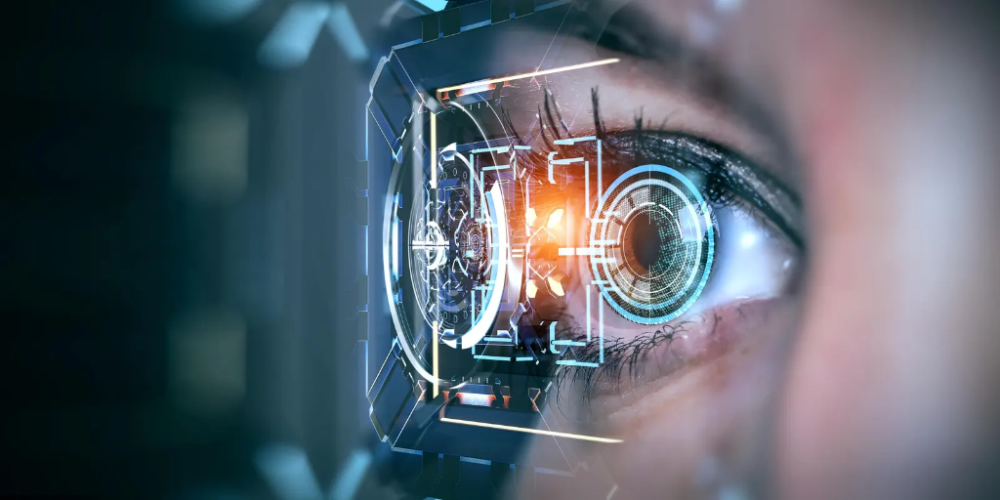

<div align="center">
  
  <h1>📷 Ultimate OpenCV Tutorial Masterclass</h1>
  <p><strong>A comprehensive, hands-on guide to Computer Vision and Image Processing with Python & OpenCV</strong></p>

  [](https://www.python.org/)
  [](https://opencv.org/)
  [](LICENSE)
</div>

---

## 📌 Overview

Welcome to the **OpenCV Tutorial Masterclass**! This repository is a meticulously structured collection of Python scripts designed to take you from the absolute basics of image processing to advanced computer vision techniques like Face and Object Detection.

Whether you are a beginner learning how to load an image, or an advanced developer building computer vision pipelines, you will find practical, executable code examples here.

---

## 🛠️ Getting Started

### 1. Prerequisites
Ensure you have Python installed on your system. You will also need the OpenCV and NumPy libraries.

```bash
pip install opencv-python numpy
```

### 2. Clone the Repository
```bash
git clone https://github.com/BhavyaKansal20/OPENCV_TUTORIAL.git
cd OPENCV_TUTORIAL
```

### 3. Run a Script
Pick any script from the repository and run it! For example:
```bash
python display.py
```

---

## 📂 Repository Structure & Topics Covered

This repository covers a vast array of OpenCV functionalities, neatly categorized into individual scripts:

### 🖼️ Core Image Operations
*   `loading.py`, `display.py`, `saving.py` - Read, display, and write images.
*   `imageresize.py`, `cropped.py`, `fliped.py`, `rotate.py` - Image transformations.
*   `shape.py` - Extracting image dimensions and channels.

### 🎨 Colors & Drawing
*   `grayscale.py` - Color space conversions (BGR to Grayscale).
*   `drawcircle.py`, `drawrectangle.py`, `linedraw.py` - Drawing shapes on images.
*   `writetext.py` - Overlaying text on images.

### 🎛️ Image Processing & Filters
*   `gaussianblur.py`, `medianblur.py` - Smoothing and denoising (removing noise from `noisy_img.png`).
*   `sharpening.py` - Enhancing image details.
*   `threshhold.py` - Binarization and segmentation.
*   `bitwise_op.py` - Bitwise AND, OR, XOR, NOT operations.
*   `canny.py` - Canny Edge Detection.
*   `countor.py` - Contour detection and shape analysis.

### 🎥 Video Processing
*   `videocapture.py` - Reading from a webcam or video file.
*   `savingvideo.py` - Writing and encoding video streams.

---

## 🏆 Mini Projects

Put your skills to the test with the included mini-projects that combine multiple OpenCV techniques to solve real-world problems!
*   **`miniproject1.py`** - Interactive Image processing application.
*   **`miniproject2.py`** - Advanced computer vision pipeline.
*   **`Face and Object Detection/`** - Dedicated module for Haar Cascades and deep learning-based detection models.

---

## 🤝 Contributing

Contributions are highly encouraged! Whether it's adding a new tutorial script, optimizing existing code, or fixing a typo, your help is welcome.

Please read our [Contributing Guidelines](CONTRIBUTING.md) and [Code of Conduct](CODE_OF_CONDUCT.md) before submitting a pull request.

---

## 🔐 Security

If you discover any security vulnerabilities, please refer to our [Security Policy](SECURITY.md) for reporting instructions.

---

## 📄 License

This project is licensed under the MIT License - see the [LICENSE](LICENSE) file for details.

---

<div align="center">
  Maintained with ❤️ by <strong>Bhavya Kansal</strong>
</div>
